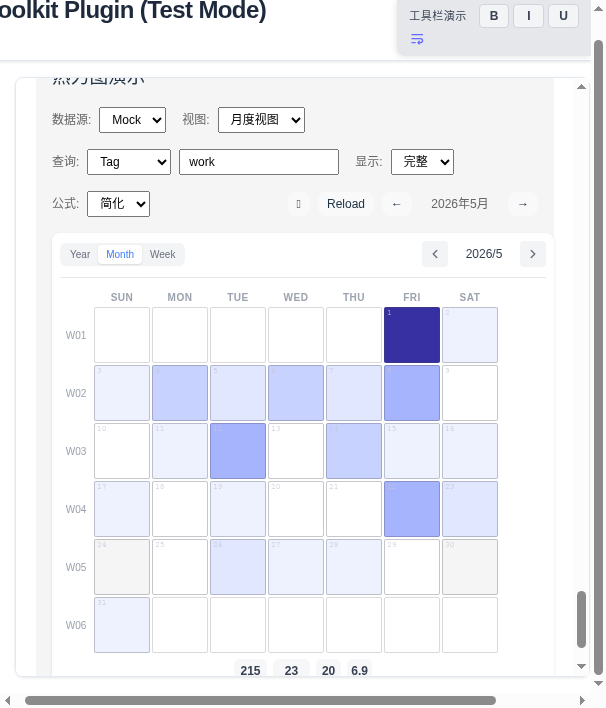
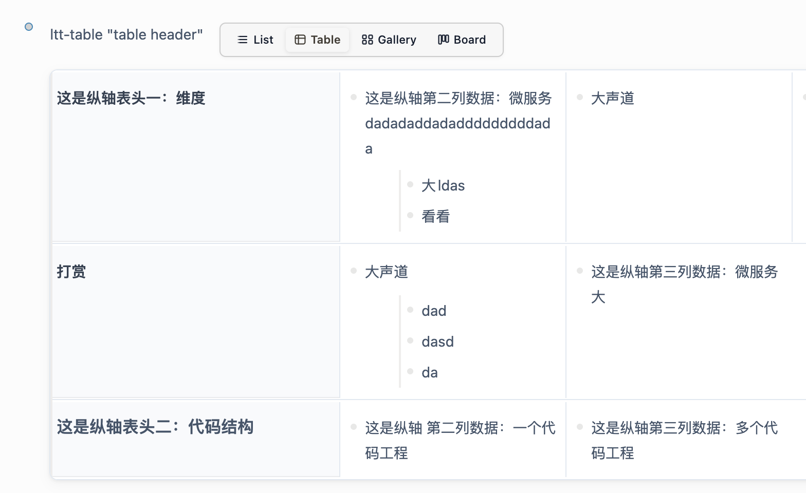
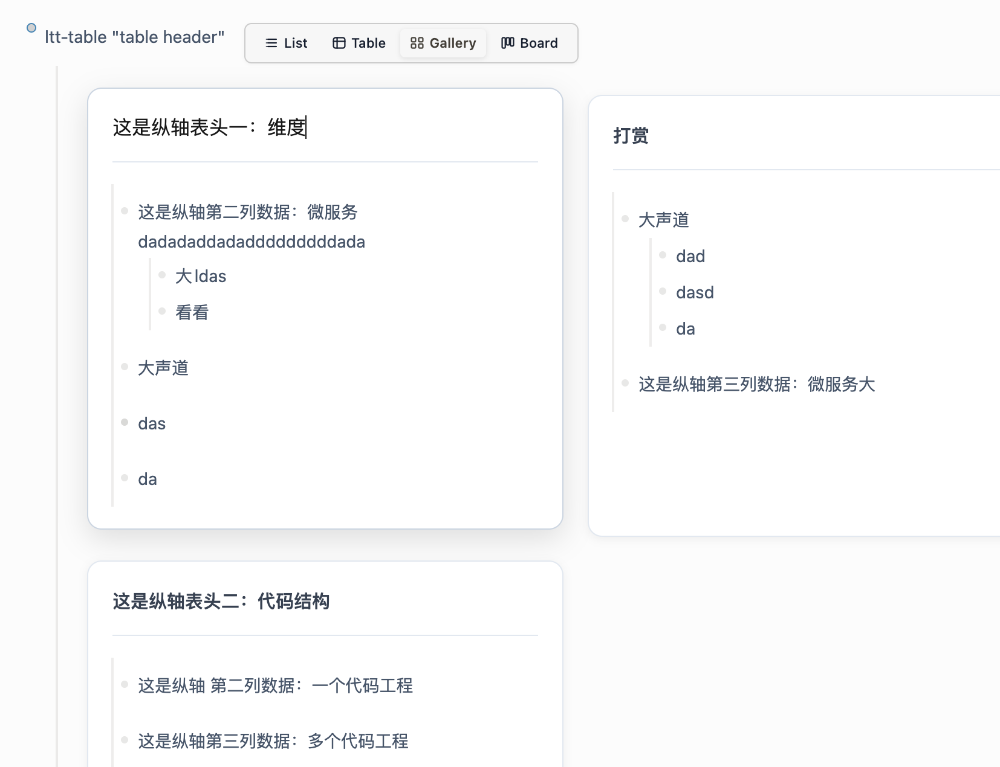
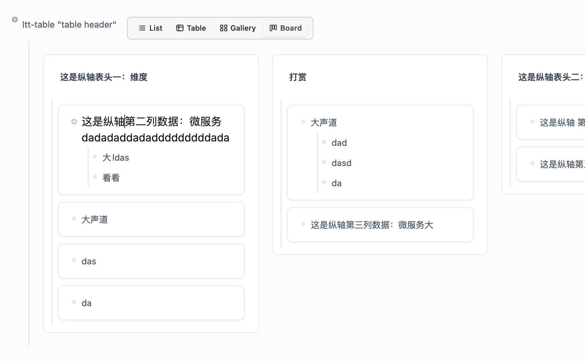

# Logseq Text Toolkit ✨

A powerful and flexible Logseq plugin designed to enhance text editing and formatting capabilities.

[English Version](README.en.md) | [中文版本](README.md)

👉 [Online Preview](https://duiliuliu.github.io/logseq-text-toolkit/) | [Experimental Preview](https://duiliuliu.github.io/logseq-text-toolkit/dev/) | [Detailed User Guide](docs/USER_GUIDE.en.md)

---

## 一、Showcase

<table>
  <tr>
    <td align="center">
      
      <br>Text Formatting
    </td>
    <td align="center">
      
      <br>Toolbar Buttons
    </td>
      <td align="center">
      
      <br>Task Progress Tracking
    </td>
  </tr>
  <tr>
    <td align="center">
       
      <br>Toolbar Settings Panel
    </td>
      <td align="center">
       
      <br>Task Progress Settings
    </td>
    <td align="center">
      
      <br>Heatmap
    </td>
  </tr>
  <tr>
    <td align="center">
      
      <br>Block View - Table
    </td>
    <td align="center">
      
      <br>Block View - Gallery
    </td>
    <td align="center">
      
      <br>Block View - Board
    </td>
  </tr>
</table>

---

## 二、Key Features

### 📝 Text Formatting

| Feature | Description |
|---------|-------------|
| Bold, Italic, Strikethrough, Subscript, Superscript, Code | Common text formatting operations |
| Background Highlights | 5 colors: Red/Yellow/Blue/Green/Purple |
| Text Colors | Multiple colors available |
| Colorful Underlines | 5 colors available |
| File Links | Quick file link insertion |

**Usage**: Select text → Toolbar auto-pops up → Click button

---

### 📊 Task Progress Tracking

| Feature | Description |
|---------|-------------|
| Display Styles | Mini Circle, Dot Matrix, Status Cursor, Progress Capsule, Step Progress |
| Nested Statistics | Supports 1-N level nesting, only counts leaf tasks |
| Status Recognition | Auto-detects todo/doing/done/waiting/in-review etc. |
| Custom Colors | Customizable status colors |
| 🎆 Achievement Fireworks | Fireworks when all tasks complete (toggleable) |

**Basic Usage**:
```markdown
- My Project {{renderer :taskprogress}}
  - Task 1 #task status:: todo
  - Task 2 #task status:: doing
  - Task 3 #task status:: done
```

---

### 🔥 Heatmap

| Feature | Description |
|---------|-------------|
| Views | year / month / week three views |
| Query | Supports tag / page / property three query methods |
| Color Scheme | Min/max gradient colors and two calculation formulas |

**Basic Usage**:
```markdown
{{renderer :heatmap, month, tag=work}}
{{renderer :heatmap, view=year, tag=work}}
{{renderer :heatmap, view=month, page=My Page}}
```

---

### 📋 Block View 🆕

| Feature | Description |
|---------|-------------|
| View Types | List, Table, Gallery, Board |
| Theme Support | Default, Notion, Linear, Dark, Gradient, Tana, Custom |
| Custom Themes | Independent color, border, radius configuration per view |
| View Switcher | Show/hide toggle |

**Basic Usage**:
```markdown
{{renderer :block-view}}
{{renderer :block-view, view=table}}
{{renderer :block-view, view=gallery}}
{{renderer :block-view, view=board}}
```

**Specify Theme**:
```markdown
{{renderer :block-view, theme=notion}}
{{renderer :block-view, view=table, theme=linear}}
```

**Parameters**:
| Parameter | Description | Values |
|-----------|-------------|--------|
| view | View Type | list, table, gallery, board |
| theme | Theme Style | default, notion, linear, dark, gradient, tana, custom |
| hideBar | Hide Switcher | true, false |

---

### 📝 Summary Generator (Summary) ⚠️

| Feature | Description |
|---------|-------------|
| Summary Types | Weekly, Monthly, Yearly, Custom time range |
| Templates | GTD Work Review, Minimal Dashboard, Bullet Journal, OKR Review, Study Summary |
| AI Enhancement | OpenAI/Claude support |

> ⚠️ Summary feature is under development and currently unavailable.

---

### 🎛️ Toolbar

| Feature | Description |
|---------|-------------|
| Auto-popup | Toolbar appears when text is selected |
| Shortcuts | Customizable keyboard shortcuts |
| Internationalization | Uses emoji icons with multi-language support |

---

### ⚙️ Theme & Multi-language

| Feature | Description |
|---------|-------------|
| Theme | light / dark auto-follows Logseq |
| Languages | Chinese, English, Japanese |
| Extensibility | CSS override, language file extension |

---

### 🎨 CSS Customization

Override default styles via Logseq CSS:

```css
/* Custom toolbar styles */
.ltt-toolbar {
  --ltt-bg: #ffffff;
  --ltt-border: #e5e7eb;
}

/* Custom task progress colors */
.ltt-task-progress {
  --ltt-done-color: #22c55e;
}
```

---

## 三、Installation

### Method 1: Plugin Marketplace (Recommended)

1. Logseq → Menu → **Plugins**
2. Search `logseq-text-toolkit` → **Install**

### Method 2: GitHub URL

1. Logseq → Menu → **Plugins**
2. Click **Load plugin from URL**
3. Enter: `https://github.com/duiliuliu/logseq-text-toolkit/`

---

## 四、Detailed Usage Guide

### 4.1 Text Formatting

Select text → Toolbar auto-pops up → Click button

**Color Options**:
- 🔴 Red
- 🟡 Yellow
- 🔵 Blue
- 🟢 Green
- 🟣 Purple

### 4.2 Task Progress Tracking

#### Supported Task Statuses

| Status | Label | Description |
|--------|-------|-------------|
| todo | To Do | Tasks not yet started |
| doing | In Progress | Currently executing tasks |
| in-review | In Review | Tasks awaiting review |
| done | Done | Completed tasks |
| waiting | Waiting | Tasks waiting for other tasks |
| canceled | Canceled | Canceled tasks |

#### Display Style Parameters

| Style | Command Parameter |
|-------|-----------------|
| Mini Circle | mini-circle |
| Dot Matrix | dot-matrix |
| Status Cursor | status-cursor |
| Progress Capsule | progress-capsule |
| Step Progress | step-progress |

#### Nested Levels

| Nested Level | Description |
|--------------|-------------|
| Current Level Only | Only count direct subtasks |
| 2 Levels Deep | Count current and next level |
| 3 Levels Deep | Count current and two levels down |
| All Levels | Count all nested levels |

### 4.3 Heatmap

#### View Types

| View | Parameter | Description |
|------|-----------|-------------|
| Year View | year | Display full year heatmap |
| Month View | month | Display single month heatmap |
| Week View | week | Display single week heatmap |

#### Query Methods

| Query Type | Parameter Format | Example |
|------------|------------------|---------|
| Tag Query | tag=tagname | tag=work |
| Page Query | page=pagename | page=My Page |
| Property Query | property=property::value | property=category::work |

### 4.4 Block View

#### Theme Styles

| Theme | Features | Use Case |
|-------|----------|----------|
| Default | Clean and clear | General use |
| Notion | Borderless, minimalist | Pursue simplicity |
| Linear | Tech-focused | Programmers |
| Dark | Dark color scheme | Night use |
| Gradient | Gradient effects | Aesthetic appeal |
| Tana | Soft colors | Fresh style |
| Custom | Fully customizable | Custom needs |

### 4.5 Toolbar Configuration

Configure toolbar elements via JSON in Settings:

```json
[
  {
    "id": "format-bold",
    "label": "Bold",
    "icon": "**",
    "invoke": "editor/insert-batch-edit",
    "invokeParams": {
      "texts": [["**{{selected}}**", "{{selected}}**"]]
    }
  }
]
```

**Configuration Fields**:
| Field | Type | Description |
|-------|------|-------------|
| id | string | Unique identifier |
| label | string | Button display name |
| icon | string | Button icon (supports emoji) |
| invoke | string | Logseq command to invoke |
| invokeParams | object | Command parameters |
| hidden | boolean | Hide button |

### 4.6 Custom Languages and Internationalization

The plugin supports multi-language extension. You can add new language packs or modify existing translations.

#### Language Files Location

Language files are located in `dist/translations/` directory, containing:
- `zh-CN.json` - Simplified Chinese
- `en.json` - English
- `ja.json` - Japanese

#### Adding New Languages

**Step 1: Create Language File**

Create a new JSON file in `dist/translations/` (e.g., `de.json` for German):

```json
{
  "toolbar": {
    "bold": "Fett",
    "highlight": "Hervorheben"
  },
  "settings": {
    "title": "Einstellungen"
  }
}
```

**Step 2: Register New Language**

Add new language type in source code `src/translations/translations.ts`:

```typescript
export type SupportedLanguage = 'en' | 'ja' | 'zh-CN' | 'system' | 'de'; // Add 'de'
```

**Step 3: Import Language File**

Import and register the new language in `src/translations/i18n.ts`:

```typescript
import de from './de.json';

const translations: Translations = {
  en: enTranslations,
  ja: jaTranslations,
  'zh-CN': zhCNTranslations,
  de: de, // Add German translation
};
```

**Step 4: Rebuild Plugin**

```bash
npm run build
```

#### Modifying Existing Translations

If you only want to modify some translations, you can directly edit the corresponding JSON file in `dist/translations/`:

```bash
# Edit Chinese translation
vim dist/translations/zh-CN.json

# Edit English translation
vim dist/translations/en.json
```

You need to restart the plugin for changes to take effect.

#### Translation File Structure

Each language JSON file structure:

```json
{
  "toolbar": {
    "bold": "Bold",
    "highlight": "Highlight",
    "fileLink": "File Link",
    "comment": "Comment"
  },
  "settings": {
    "title": "Settings",
    "tabs": {
      "general": "⚙️ General Settings",
      "toolbar": "🛠️ Toolbar Settings"
    },
    "enabled": "Enable",
    "disabled": "Disable"
  },
  "blockView": {
    "description": "Configure the global default behavior of the block view module.",
    "enabled": "Enable Block View"
  }
}
```

### 4.7 Custom CSS Styles

The plugin's CSS files are located in `dist/` directory. You can customize styles by modifying CSS files.

#### CSS Files Description

| Filename | Description |
|----------|-------------|
| `toolbar.css` | Toolbar styles |
| `taskProgress.css` | Task progress styles |
| `heatmap.css` | Heatmap styles |
| `blockView.css` | Block view base styles |
| `tableView.css` | Table view styles |
| `galleryView.css` | Gallery view styles |
| `boardView.css` | Board view styles |
| `settingsModal.css` | Settings panel styles |
| `summary.css` | Summary generation styles |
| `customSelect.css` | Custom dropdown styles |

#### Custom Style Methods

**Method 1: Directly Modify CSS Files (Recommended for Deep Customization)**

1. Find the corresponding CSS file in `dist/` directory
2. Modify CSS rules
3. Restart the plugin for changes to take effect

```bash
# Edit toolbar styles
vim dist/toolbar.css

# Edit table view styles
vim dist/tableView.css
```

**Method 2: Use Logseq CSS Override (Recommended for Simple Customization)**

Add override styles in Logseq's `custom.css` file:

```css
/* Custom toolbar styles */
.ltt-toolbar {
  --ltt-bg: #ffffff;
  --ltt-border: #e5e7eb;
  border-radius: 8px;
  box-shadow: 0 4px 12px rgba(0, 0, 0, 0.1);
}

/* Custom task progress colors */
.ltt-task-progress {
  --ltt-done-color: #22c55e;
  --ltt-todo-color: #94a3b8;
}

/* Custom table view styles */
.ltt-table-root {
  --ltt-border: #e2e8f0;
  --ltt-header-bg: #f8fafc;
  --ltt-radius: 8px;
}

/* Custom view switcher bar */
.ltt-view-bar {
  background: linear-gradient(135deg, #667eea 0%, #764ba2 100%);
  border-radius: 6px;
}

/* Dark mode customization */
.dark .ltt-toolbar {
  --ltt-bg: #1e2128;
  --ltt-border: rgba(255, 255, 255, 0.1);
}
```

#### CSS Variables Reference

| Variable | Description | Example Value |
|----------|-------------|---------------|
| `--ltt-bg` | Background color | `#ffffff` |
| `--ltt-border` | Border color | `#e5e7eb` |
| `--ltt-text` | Text color | `#333333` |
| `--ltt-primary` | Primary color | `#3b82f6` |
| `--ltt-hover` | Hover color | `rgba(0,0,0,0.05)` |

#### Custom Theme Examples

**Notion Style Theme**:

```css
.ltt-table-root.theme-notion {
  --ltt-border: #f0f0f0;
  --ltt-header-bg: #ffffff;
  --ltt-radius: 0px;
  --ltt-shadow: none;
}
```

**Dark Tech Style**:

```css
.dark .ltt-table-root.theme-linear {
  --ltt-border: rgba(255, 255, 255, 0.08);
  --ltt-header-bg: #1e2128;
  --ltt-header-text: #5e6ad2;
  --ltt-cell-text: #b8c0cc;
}
```

#### Notes

1. **Priority**: Logseq's custom.css has higher priority than plugin's built-in CSS
2. **Override Method**: Use `!important` to force override
3. **Dark Mode**: Plugin automatically follows Logseq's dark mode. It is recommended to configure `.dark` selector as well
4. **Backup**: It is recommended to backup original CSS files before modification
5. **Debugging**: Use browser developer tools to view actually applied styles

---

## 五、Development Guide

### Development Environment

```bash
npm install          # Install dependencies
npm run dev          # Development server (http://localhost:3000)
npm run build        # Build production version
npm run test         # Test mode
```

### Project Structure

```
src/
├── components/       # React components
│   ├── Toolbar/     # Toolbar component
│   ├── TaskProgress/# Task Progress component
│   ├── Heatmap/     # Heatmap component
│   ├── BlockView/   # Block View component
│   ├── Summary/     # Summary component
│   └── SettingsModal/# Settings panel
├── lib/            # Business logic
│   ├── blockView/  # Block View logic
│   ├── summary/    # Summary logic
│   └── render/     # Renderer related
├── settings/       # Settings management
├── translations/    # Internationalization files
└── utils/          # Utility functions
```

### CSS Variables

| Variable | Description |
|----------|-------------|
| --ltt-bg | Background color |
| --ltt-border | Border color |
| --ltt-text | Text color |
| --ltt-primary | Primary color |
| --ltt-hover | Hover color |

---

## 六、License

MIT
