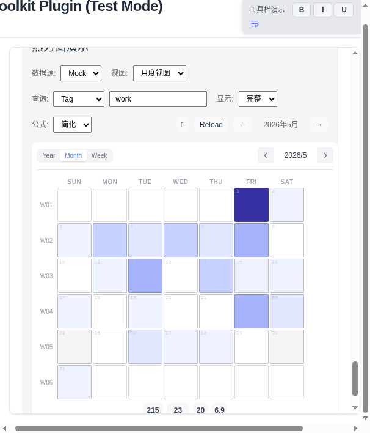
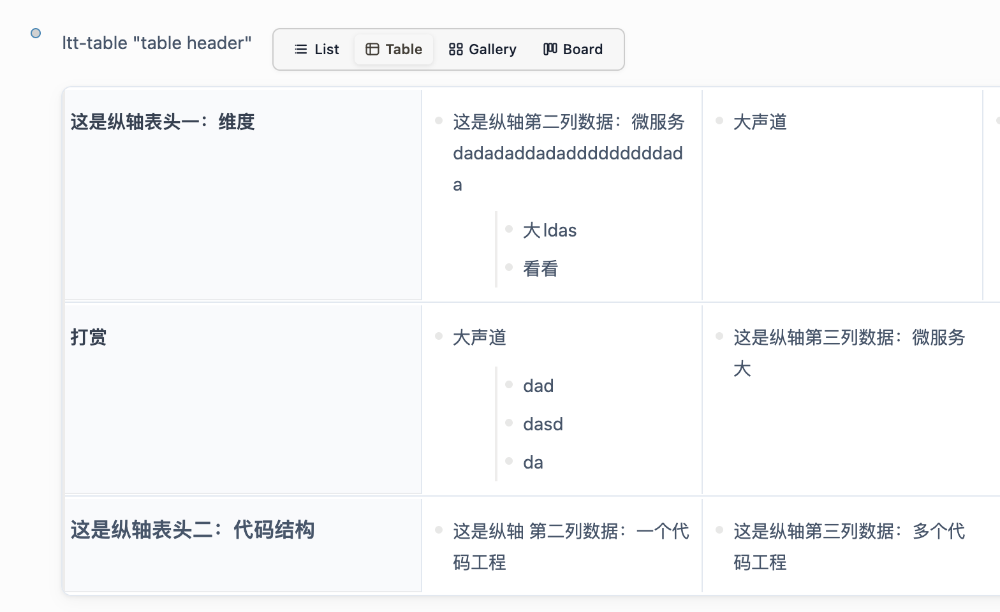
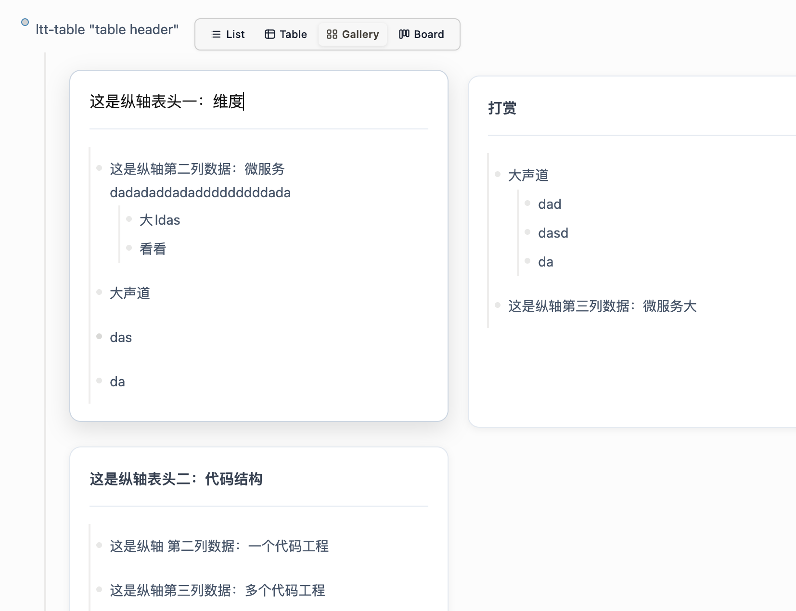
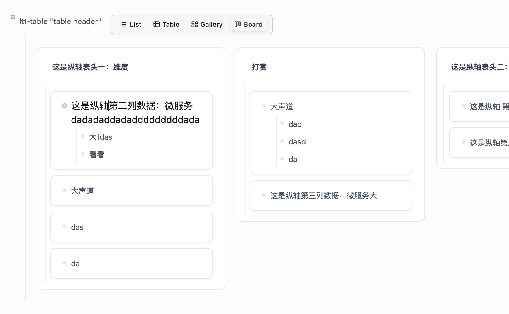

# Logseq Text Toolkit ✨

一个功能强大、灵活的 Logseq 插件，增强文本编辑和格式化能力。

[English Version](README.en.md) | 中文版本

👉 [在线预览](https://duiliuliu.github.io/logseq-text-toolkit/) | [实验版本预览](https://duiliuliu.github.io/logseq-text-toolkit/dev/) | [用户详细操作指导](docs/USER_GUIDE.md)

---

## 一、示例展示

<table>
  <tr>
    <td align="center">
      
      <br>文本操作
    </td>
    <td align="center">
      
      <br>工具栏按钮
    </td>
      <td align="center">
      
      <br>任务进度追踪
    </td>
  </tr>
  <tr>
    <td align="center">
       
      <br>Toolbar 设置面板
    </td>
      <td align="center">
       
      <br>Task Progress 设置面板
    </td>
    <td align="center">
      
      <br>Heatmap 热力图
    </td>
  </tr>
  <tr>
    <td align="center">
      
      <br>块视图 - 表格
    </td>
    <td align="center">
      
      <br>块视图 - 画廊
    </td>
    <td align="center">
      
      <br>块视图 - 看板
    </td>
  </tr>
  <tr>
    <td align="center">
      
      <br>块视图 - 思维 (实验) 🧪
    </td>
     <td align="center">
    
      <br>里程碑
    </td>

  </tr>
</table>

---

## 二、主要功能

### 🎯 Milestone 里程碑追踪

| 功能 | 说明 |
|------|------|
| 展示样式 | 胶囊、徽章、轨道、卡片、紧凑 五种风格 |
| 查询方式 | 支持标签、页面、属性三种查询方式 |
| 模板系统 | 支持预定义模板，快速配置和复用 |
| 自动进度 | 根据任务状态自动计算里程碑进度 |
| 时间轴 | 显示每个里程碑的计划或完成日期 |

**基本使用：**
```markdown
{{renderer :milestone, displayStyle=capsule, filterTag=project, milestonePropKey=phase, milestoneList=需求;设计;开发;测试;上线}}
```

**使用模板：**
```markdown
{{renderer :milestone, template=my_template}}
```

### 📝 文本格式化

| 功能 | 说明 |
|------|------|
| 加粗、斜体、删除线、下标、上标、代码块 | 常用格式快捷操作 |
| 背景高亮 | 红/黄/蓝/绿/紫 五色可选 |
| 文本颜色 | 多种颜色可选 |
| 彩色下划线 | 红/黄/蓝/绿/紫 五色 |
| 文件链接 | 快速插入文件链接 |

**使用方式**：选中文本 → 工具栏自动弹出 → 点击相应按钮

---

### 📊 任务进度追踪

| 功能 | 说明 |
|------|------|
| 展示样式 | 微型圆环、点阵进度、状态光标、进度胶囊、阶梯进度 |
| 嵌套统计 | 支持 1-N 层嵌套，仅统计叶子任务 |
| 状态识别 | 自动识别 todo/doing/done/waiting/in-review 等 |
| 自定义颜色 | 支持自定义状态颜色 |
| 🎆 成就烟花 | 任务全部完成时绽放绚丽烟花（可开关） |

**基本使用**：
```markdown
- 我的项目 {{renderer :taskprogress}}
  - 任务1 #task status:: todo
  - 任务2 #task status:: doing
  - 任务3 #task status:: done
```

---

### 🔥 Heatmap 热力图

| 功能 | 说明 |
|------|------|
| 视图 | year / month / week 三视图 |
| 查询 | 支持 tag / page / property 三种查询方式 |
| 配色 | 支持 min/max 渐变颜色与两种计算公式 |
| 快捷创建 | 支持点击 month 和周数创建对应日期页面 |

**基本使用**：
```markdown
{{renderer :heatmap, month, tag=work}}
{{renderer :heatmap, view=year, tag=work}}
{{renderer :heatmap, view=month, page=My Page}}
```

---

### 📋 块视图 (Block View) 🆕

| 功能 | 说明 |
|------|------|
| 视图类型 | 列表、表格、画廊、看板、思维（实验） |
| 主题支持 | 默认、Notion、Linear、深色、渐变、Tana、自定义 |
| 自定义主题 | 支持各视图独立配置颜色、边框、圆角等 |
| 视图切换栏 | 可显示/隐藏 |

**基本使用**：
```markdown
{{renderer :block-view}}
{{renderer :block-view, view=table}}
{{renderer :block-view, view=gallery}}
{{renderer :block-view, view=board}}
```

**指定主题**：
```markdown
{{renderer :block-view, theme=notion}}
{{renderer :block-view, view=table, theme=linear}}
```

**参数说明**：
| 参数 | 说明 | 可选值 |
|------|------|--------|
| view | 视图类型 | list, table, gallery, board, mind |
| theme | 主题风格 | default, notion, linear, dark, gradient, tana, custom |
| hideBar | 隐藏切换栏 | true, false |

**使用思维视图（实验功能）**：
```markdown
{{renderer :block-view, view=mind}}
```

> ⚠️ 思维视图是实验功能，正在持续优化中。

---

### 📝 总结生成 (Summary) ⚠️

| 功能 | 说明 |
|------|------|
| 总结类型 | 周度、月度、年度、自定义时间范围 |
| 模板支持 | GTD 工作回顾、极简仪表盘、子弹日记、OKR 回顾、学习总结 |
| AI 增强 | 支持 OpenAI/Claude 接入 |

> ⚠️ 总结功能正在开发中，暂时不可用。

---

### 🎛️ 工具栏

| 功能 | 说明 |
|------|------|
| 自动弹出 | 选中文本自动显示工具栏 |
| 快捷键 | 支持自定义快捷键绑定 |
| 按钮国际化 | 使用 emoji 图标，支持多语言显示 |

---

### ⚙️ 主题与多语言

| 功能 | 说明 |
|------|------|
| 主题 | light / dark 自动跟随 Logseq |
| 多语言 | 中文、English、日语 |
| 扩展性 | CSS 样式覆盖、语言文件扩展 |

---

### 🎨 CSS 自定义

在 Logseq 设置中可通过 CSS 覆盖默认样式：

```css
/* 自定义工具栏样式 */
.ltt-toolbar {
  --ltt-bg: #ffffff;
  --ltt-border: #e5e7eb;
}

/* 自定义任务进度颜色 */
.ltt-task-progress {
  --ltt-done-color: #22c55e;
}
```

---

## 三、安装

### 方式一：插件市场（推荐）

1. Logseq → 右上角菜单 → **插件**
2. 搜索 `logseq-text-toolkit` → **安装**

### 方式二：GitHub 加载

1. Logseq → 右上角菜单 → **插件**
2. 点击 **从 URL 加载插件**
3. 输入：`https://github.com/duiliuliu/logseq-text-toolkit/`

---

## 四、功能使用详细说明

### 4.1 Milestone 里程碑追踪

#### 4.1.1 宏命令参数说明

Milestone 组件支持丰富的参数配置，可通过宏命令进行精细控制：

| 参数名 | 类型 | 必填 | 默认值 | 说明及业务作用 |
|--------|------|------|--------|---------------|
| template | string | 否 | - | 预定义里程碑模板名（如 `interview`）。传入后，详细参数依赖从 Settings 中获取；如果同时传入模版和其他参数，则用宏命令中的其他参数对预设参数覆盖。 |
| filterTag | string | 否 | - | 筛选标签：按标签过滤数据源块。示例：`面试`。对应查询条件：`[?b :block/tags ?t] [?t :block/title "面试"]` |
| filterPropKey | string | 否 | - | 筛选属性键：联合属性值做精准过滤。示例：`:user.property/company-dJukHEKU` |
| filterPropValue | string | 否 | - | 筛选属性值：配合 `filterPropKey` 使用。示例：`Web3 Holdings Limited` |
| milestonePropKey | string | 是 | - | 里程碑标识属性键（原 `targetPropertyK`）。该字段两个作用：① 从筛选后的块中读取该属性的值，作为里程碑节点名称；② 在没有 `list` 信息时，根据该属性获取所有 value 作为 list。同时存在优先取 list。 |
| milestoneList | string[] | 否 | - | 手动静态里程碑列表。传入后走列表模式，不再从块中动态解析节点。示例：`["投递简历","技术一面"]` |
| displayStyle | string | 否 | capsule | 展示样式，可选值见下方「样式参数」表格 |
| showProgress | boolean | 否 | true | 是否展示进度百分比 |
| showLabel | boolean | 否 | true | 是否展示节点文字标签 |
| dateField | string | 否 | scheduled | 进度/状态计算依赖的日期属性 |
| inline | boolean | 否 | false | 是否启用行内模式（无边框、无背景色） |

#### 4.1.2 样式参数 (displayStyle)

| 样式参数值 | 中文名称 | 英文名称 | 说明 |
|-----------|---------|---------|------|
| capsule | 胶囊进度条 | Capsule Progress | 经典胶囊形状，带进度条连接线 |
| badge | 数字徽章 | Number Badge | 圆形徽章显示进度，适合紧凑展示 |
| track | 极简轨道 | Minimal Track | 极简风格，只显示节点和连线 |
| card | 卡片浮层 | Card Overlay | 卡片式布局，适合详细信息展示 |
| compact | 状态徽章 | Compact Badge | 超紧凑，适合嵌入文本 |
| arrow-capsule | 箭头胶囊 | Arrow Capsule | 带箭头连接线，适合流程展示 |
| timeline-track | 时间线轨道 | Timeline Track | 时间线风格，适合时间轴展示 |

#### 4.1.3 使用示例

**基础使用（使用模板）：**
```markdown
{{renderer :milestone, template=my_template}}
```

**列表模式（手动指定里程碑节点）：**
```markdown
{{renderer :milestone, milestonePropKey=:phase, milestoneList=需求;设计;开发;测试;上线}}
```

**标签筛选模式：**
```markdown
{{renderer :milestone, filterTag=面试, milestonePropKey=:interview-phase}}
```

**属性筛选模式：**
```markdown
{{renderer :milestone, filterPropKey=:user.property/company, filterPropValue=安克, milestonePropKey=:interview-phase}}
```

**指定展示样式：**
```markdown
{{renderer :milestone, displayStyle=badge, milestonePropKey=:phase, milestoneList=需求;设计;开发}}
```

**行内模式（无边框背景）：**
```markdown
{{renderer :milestone, inline=true, displayStyle=compact, milestonePropKey=:phase}}
```

**完整参数示例：**
```markdown
{{renderer :milestone, filterTag=项目, milestonePropKey=:milestone, displayStyle=card, showProgress=true, showLabel=true}}
```

### 4.2 文本格式化

选中文本 → 自动弹出工具栏 → 点击相应按钮

**颜色选项**：
- 🔴 红色
- 🟡 黄色  
- 🔵 蓝色
- 🟢 绿色
- 🟣 紫色

### 4.2 任务进度追踪

#### 4.2.1 宏命令参数说明

TaskProgress 组件支持多种参数配置：

| 参数名 | 类型 | 必填 | 默认值 | 说明及业务作用 |
|--------|------|------|--------|---------------|
| type | string | 否 | mini-circle | 展示样式类型，可选值见下方「样式参数」表格 |
| showLabel | boolean | 否 | true | 是否显示进度文字标签 |
| labelFormat | string | 否 | fraction | 标签格式：`fraction`（显示分数，如 3/10）、`percentage`（显示百分比，如 30%） |
| size | string | 否 | small | 组件尺寸：`small`、`medium`、`large` |
| nestingLevel | number | 否 | 3 | 嵌套层级深度：1（仅当前层）、2（向下2层）、3（向下3层）、'all'（全部层级） |
| onlyLeaves | boolean | 否 | false | 是否只统计叶子任务（不统计父任务） |
| fireworksOnComplete | boolean | 否 | true | 任务完成时是否显示烟花特效 |
| statusColors | object | 否 | 见下方默认值 | 自定义各状态的颜色 |

**状态颜色默认值：**
```json
{
  "todo": "#f59e0b",
  "doing": "#3b82f6",
  "done": "#10b981",
  "waiting": "#8b5cf6",
  "canceled": "#6b7280",
  "in-review": "#f97316"
}
```

#### 4.2.2 支持的任务状态

| 状态标识 | 中文名称 | 说明 | 典型使用场景 |
|---------|---------|------|------------|
| todo | 待办 | 尚未开始的任务 | 计划阶段的任务 |
| doing | 进行中 | 正在执行的任务 | 当前正在处理的工作 |
| in-review | 审核中 | 等待审核的任务 | 提交审查或等待反馈 |
| done | 已完成 | 已完成的任务 | 已交付的工作项 |
| waiting | 等待中 | 等待其他任务的任务 | 依赖其他工作 |
| canceled | 已取消 | 被取消的任务 | 废弃或取消的计划 |

#### 4.2.3 展示样式参数

| 样式参数值 | 中文名称 | 说明 | 适用场景 |
|-----------|---------|------|---------|
| mini-circle | 微型圆环 | 小型圆形进度环，简洁直观 | 紧凑布局、列表项 |
| dot-matrix | 点阵进度 | 用点阵显示进度，直观明了 | 看板、甘特图 |
| status-cursor | 状态光标 | 光标形状显示当前状态 | 状态追踪 |
| progress-capsule | 进度胶囊 | 胶囊形状显示进度 | 卡片、容器 |
| step-progress | 阶梯进度 | 阶梯状显示各状态数量 | 统计分析 |

#### 4.2.4 使用示例

**基础使用（微型圆环）：**
```markdown
{{renderer :taskprogress}}
```

**指定展示样式：**
```markdown
{{renderer :taskprogress, type=dot-matrix}}
{{renderer :taskprogress, type=progress-capsule}}
{{renderer :taskprogress, type=step-progress}}
```

**控制标签显示：**
```markdown
{{renderer :taskprogress, showLabel=true, labelFormat=percentage}}
{{renderer :taskprogress, showLabel=true, labelFormat=fraction}}
```

**控制嵌套层级：**
```markdown
{{renderer :taskprogress, nestingLevel=1}}
{{renderer :taskprogress, nestingLevel=3}}
{{renderer :taskprogress, nestingLevel='all'}}
```

**只统计叶子任务：**
```markdown
{{renderer :taskprogress, onlyLeaves=true}}
```

**禁用完成烟花：**
```markdown
{{renderer :taskprogress, fireworksOnComplete=false}}
```

**完整参数示例：**
```markdown
{{renderer :taskprogress, type=progress-capsule, showLabel=true, labelFormat=percentage, nestingLevel=3}}
```

### 4.3 Heatmap 热力图

#### 4.3.1 宏命令参数说明

Heatmap 组件支持多种参数配置：

| 参数名 | 类型 | 必填 | 默认值 | 说明及业务作用 |
|--------|------|------|--------|---------------|
| view | string | 否 | year | 视图类型：`year`（年度视图）、`month`（月度视图）、`week`（周度视图） |
| tag | string | 否 | - | 标签查询：按标签过滤数据源块。示例：`tag=work` |
| page | string | 否 | - | 页面查询：按页面名过滤。示例：`page=My Page` |
| property | string | 否 | - | 属性查询：按属性和值过滤。格式：`key::value`。示例：`property=category::work` |
| displayMode | string | 否 | full | 显示模式：`minimal`（极简）、`basic`（基础）、`full`（完整） |
| colorFormula | string | 否 | simple | 配色公式：`simple`（简化）、`weighted`（加权） |
| minColor | string | 否 | #eef2ff | 最小值颜色（十六进制） |
| maxColor | string | 否 | #3730a3 | 最大值颜色（十六进制） |
| containerWidth | string | 否 | 100% | 容器宽度，支持 px 或 % |
| enableMonthPageCreation | boolean | 否 | true | 启用点击月份创建页面 |
| enableWeekPageCreation | boolean | 否 | true | 启用点击周数创建页面 |
| dateField | string | 否 | created-at | 日期字段：`created-at`、`updated-at`、`scheduled`、`deadline`、`custom` |

#### 4.3.2 视图类型说明

| 视图参数 | 中文名称 | 说明 | 适用场景 |
|---------|---------|------|---------|
| year | 年度视图 | 显示整年的热力图，按月份分组 | 年度统计、长期追踪 |
| month | 月度视图 | 显示单月热力图，按天显示 | 月度复盘、周计划 |
| week | 周度视图 | 显示单周热力图，按天显示 | 周总结、短期追踪 |

#### 4.3.3 查询方式说明

| 查询类型 | 参数格式 | 示例 | 说明 |
|---------|---------|------|------|
| 标签查询 | tag=标签名 | `tag=work` | 筛选包含指定标签的所有块 |
| 页面查询 | page=页面名 | `page=My Page` | 筛选属于指定页面的所有块 |
| 属性查询 | property=属性::值 | `property=category::work` | 筛选具有指定属性和值的块 |

#### 4.3.4 使用示例

**基础使用（年度视图）：**
```markdown
{{renderer :heatmap, year}}
{{renderer :heatmap, view=year}}
```

**月度视图：**
```markdown
{{renderer :heatmap, month}}
{{renderer :heatmap, view=month, tag=work}}
```

**周度视图：**
```markdown
{{renderer :heatmap, week}}
{{renderer :heatmap, view=week, page=My Page}}
```

**带查询条件的热力图：**
```markdown
{{renderer :heatmap, month, tag=project}}
{{renderer :heatmap, year, page=工作日志}}
{{renderer :heatmap, view=month, property=category::work}}
```

**自定义颜色：**
```markdown
{{renderer :heatmap, year, minColor=#f0f9ff, maxColor=#1e40af}}
{{renderer :heatmap, month, colorFormula=weighted}}
```

**控制容器宽度：**
```markdown
{{renderer :heatmap, year, containerWidth=800px}}
{{renderer :heatmap, month, containerWidth=100%}}
```

### 4.4 块视图 (Block View)

#### 4.4.1 宏命令参数说明

BlockView 组件支持多种参数配置：

| 参数名 | 类型 | 必填 | 默认值 | 说明及业务作用 |
|--------|------|------|--------|---------------|
| view | string | 否 | list | 视图类型，可选值见下方「视图类型」表格 |
| theme | string | 否 | default | 主题风格，可选值见下方「主题风格」表格 |
| hideBar | boolean | 否 | false | 是否隐藏视图切换栏 |
| customTheme | object | 否 | - | 自定义主题配置对象 |

#### 4.4.2 视图类型说明

| 视图参数值 | 中文名称 | 说明 | 适用场景 |
|-----------|---------|------|---------|
| list | 列表视图 | 按列表形式展示块 | 通用场景 |
| table | 表格视图 | 按表格形式展示块 | 结构化数据 |
| gallery | 画廊视图 | 卡片式画廊展示 | 视觉呈现 |
| board | 看板视图 | 看板形式分组展示 | 项目管理 |
| mind | 思维导图 | 思维导图形式展示 | 结构梳理 🧪（实验功能） |

#### 4.4.3 主题风格说明

| 主题参数值 | 中文名称 | 特点 | 适用场景 |
|-----------|---------|------|---------|
| default | 默认主题 | 简洁清晰 | 通用场景 |
| notion | Notion 风格 | 无边框、极简设计 | 追求简洁 |
| linear | Linear 风格 | 科技感强 | 程序员风格 |
| dark | 深色主题 | 深色配色 | 夜间使用 |
| gradient | 渐变主题 | 渐变效果 | 追求美观 |
| tana | Tana 风格 | 柔和配色 | 清新风格 |
| custom | 自定义主题 | 完全自定义 | 按需配置 |

#### 4.4.4 使用示例

**基础使用（默认列表视图）：**
```markdown
{{renderer :block-view}}
```

**指定视图类型：**
```markdown
{{renderer :block-view, view=table}}
{{renderer :block-view, view=gallery}}
{{renderer :block-view, view=board}}
{{renderer :block-view, view=mind}}
```

**指定主题风格：**
```markdown
{{renderer :block-view, theme=notion}}
{{renderer :block-view, view=table, theme=linear}}
{{renderer :block-view, view=gallery, theme=dark}}
```

**隐藏切换栏：**
```markdown
{{renderer :block-view, hideBar=true}}
{{renderer :block-view, view=board, hideBar=true, theme=notion}}
```

**组合参数：**
```markdown
{{renderer :block-view, view=table, theme=notion, hideBar=false}}
{{renderer :block-view, view=gallery, theme=gradient, hideBar=true}}
```

**思维导图视图（实验功能）：**
```markdown
{{renderer :block-view, view=mind}}
{{renderer :block-view, view=mind, theme=gradient}}
```

> ⚠️ 思维视图是实验功能，正在持续优化中。在以下情况下可能需要优化：
> - 非常大的层级结构（100+ 节点）
> - 深层嵌套（超过 6 层）
> - 包含大量特殊字符或格式的块

### 4.5 工具栏配置

#### 4.5.1 配置概述

工具栏支持通过 JSON 配置自定义按钮，可在设置面板的 **Toolbar** 标签页进行配置。每个按钮可以包含以下属性：

| 字段 | 类型 | 必填 | 说明 |
|------|------|------|------|
| id | string | 是 | 唯一标识符，不可重复 |
| label | string | 是 | 按钮显示名称 |
| icon | string | 否 | 按钮图标，支持 emoji、SVG、HTML |
| binding | string | 否 | 快捷键绑定，格式：`mod+shift+I` |
| invoke | string | 是 | 调用的命令类型：`replace`、`regexReplace`、`invoke` |
| invokeParams | string \| object | 是 | 命令参数 |
| hidden | boolean | 否 | 是否隐藏按钮，默认 false |
| subItems | array | 否 | 子菜单项数组（用于创建下拉菜单）|

#### 4.5.2 调用类型详解

**1. replace（文本替换）**
最常用的类型，用于包裹选中文本。

```json
{
  "id": "wrap-bold",
  "label": "Bold",
  "invoke": "replace",
  "invokeParams": "**${selectedText}**"
}
```

支持的格式：
- Markdown 格式：`**${selectedText}**`、`*${selectedText}*`、`~~${selectedText}~~`
- Hiccup 格式：`[:b ${selectedText}]`、`[:span.red ${selectedText}]`、`[:mark ${selectedText}]`
- 自定义格式：`[:u.blue ${selectedText}]`（彩色下划线）

**2. regexReplace（正则替换）**
用于移除格式或其他复杂文本处理。

```json
{
  "id": "remove-formatting",
  "label": "Remove formatting",
  "invoke": "regexReplace",
  "invokeParams": {
    "regex": "\\[:span\\.inline-comment\\s*\\{[^}]*\\}\\s*([^\\]]*)\\]|...",
    "replacement": "$1$2$3$4$5$6$7"
  }
}
```

**3. invoke（调用插件命令）**
用于调用 Logseq 内置命令或插件命令。

```json
{
  "id": "wrap-inline-comment",
  "label": "Comment",
  "invoke": "invoke",
  "invokeParams": "inlineComment"
}
```

#### 4.5.3 默认配置项

插件提供以下默认工具栏按钮：

##### 格式化组 (Format)

| 按钮 ID | 标签 | 快捷键 | 功能说明 | 示例 |
|---------|------|--------|---------|------|
| wrap-bold | Bold | - | 加粗文本 | `**选中文本**` |
| wrap-italic | Italic | mod+shift+i | 斜体文本 | `*选中文本*` |
| wrap-strike-through | Strike | - | 删除线 | `~~选中文本~~` |
| wrap-subscript | Subscript | - | 下标文本 | `[:sub 选中文本]` |
| wrap-superscript | Superscript | - | 上标文本 | `[:sup 选中文本]` |
| wrap-code | Code | - | 行内代码 | `` `选中文本` `` |

##### 高亮组 (Highlight)

| 按钮 ID | 标签 | 颜色 | 功能说明 | 示例 |
|---------|------|------|---------|------|
| wrap-yellow-hl | Yellow | #fff79e | 黄色高亮 | `==选中文本==` |
| wrap-red-hl | Red | #ffd6d6 | 红色高亮 | `[:mark.red 选中文本]` |
| wrap-blue-hl | Blue | #dbebff | 蓝色高亮 | `[:mark.blue 选中文本]` |
| wrap-green-hl | Green | #d3ffd3 | 绿色高亮 | `[:mark.green 选中文本]` |
| wrap-purple-hl | Purple | #f0e0ff | 紫色高亮 | `[:mark.purple 选中文本]` |

##### 文本颜色组 (Text Color)

| 按钮 ID | 标签 | 颜色 | 功能说明 | 示例 |
|---------|------|------|---------|------|
| wrap-red-text | Red text | #ef4444 | 红色文字 | `[:span.red 选中文本]` |
| wrap-blue-text | Blue text | #3b82f6 | 蓝色文字 | `[:span.blue 选中文本]` |
| wrap-yellow-text | Yellow text | #f59e0b | 黄色文字 | `[:span.yellow 选中文本]` |
| wrap-green-text | Green text | #22c55e | 绿色文字 | `[:span.green 选中文本]` |
| wrap-purple-text | Purple text | #a855f7 | 紫色文字 | `[:span.purple 选中文本]` |

##### 下划线组 (Underline)

| 按钮 ID | 标签 | 颜色 | 功能说明 | 示例 |
|---------|------|------|---------|------|
| wrap-red-underline | Red underline | #ef4444 | 红色下划线 | `[:u.red 选中文本]` |
| wrap-blue-underline | Blue underline | #3b82f6 | 蓝色下划线 | `[:u.blue 选中文本]` |
| wrap-yellow-underline | Yellow underline | #f59e0b | 黄色下划线 | `[:u.yellow 选中文本]` |
| wrap-green-underline | Green underline | #22c55e | 绿色下划线 | `[:u.green 选中文本]` |
| wrap-purple-underline | Purple underline | #a855f7 | 紫色下划线 | `[:u.purple 选中文本]` |

##### 其他功能按钮

| 按钮 ID | 标签 | 快捷键 | 功能说明 |
|---------|------|--------|---------|
| wrap-cloze | Cloze | - | 隐藏内容（挖空） |
| remove-formatting | Remove | mod+shift+x | 移除所有格式 |
| wrap-inline-comment | Comment | - | 添加评论 |

#### 4.5.4 配置示例

**基础配置示例：**

```json
[
  {
    "id": "wrap-bold",
    "label": "加粗",
    "icon": "**",
    "invoke": "replace",
    "invokeParams": "**${selectedText}**"
  }
]
```

**带快捷键配置：**

```json
[
  {
    "id": "wrap-bold",
    "label": "Bold",
    "icon": "**",
    "binding": "mod+shift+b",
    "invoke": "replace",
    "invokeParams": "**${selectedText}**"
  }
]
```

**带下拉菜单配置：**

```json
[
  {
    "id": "group-format",
    "label": "Format",
    "icon": "📝",
    "invoke": "replace",
    "invokeParams": "",
    "subItems": [
      {
        "id": "wrap-bold",
        "label": "Bold",
        "invoke": "replace",
        "invokeParams": "**${selectedText}**"
      },
      {
        "id": "wrap-italic",
        "label": "Italic",
        "invoke": "replace",
        "invokeParams": "*${selectedText}*"
      }
    ]
  }
]
```

**高级配置 - 正则替换：**

```json
[
  {
    "id": "remove-formatting",
    "label": "移除格式",
    "invoke": "regexReplace",
    "invokeParams": {
      "regex": "\\[:span\\.(?:red|blue|green)\\s+([^\\]]*)\\]|==([^=]*)==|\\*\\*([^*]*)\\*\\*",
      "replacement": "$1$2$3"
    }
  }
]
```

### 4.6 自定义语言和国际化

插件支持多语言扩展，您可以添加新的语言包或修改现有翻译。

#### 当前支持的语言

| 语言代码 | 语言名称 | 文件路径 |
|---------|---------|---------|
| zh-CN | 简体中文 | translations/zh-CN.json |
| en | English | translations/en.json |
| ja | 日本語 | translations/ja.json |

#### 添加新语言

需要两步：

**步骤 1：在 `dist/translations/` 添加语言文件**

创建新的语言文件（如 `de.json` 表示德语）：

```json
{
  "toolbar": {
    "bold": "Fett",
    "highlight": "Hervorheben"
  },
  "settings": {
    "title": "Einstellungen"
  }
}
```

**步骤 2：在 Settings 中注册语言**

在 `src/settings/defaultSettings.json` 的 `meta.language.languages` 数组中添加配置：

```json
{
  "code": "de",
  "name": "Deutsch",
  "path": "translations/de.json"
}
```

完整的 languages 配置示例：

```json
"languages": [
  {
    "code": "zh-CN",
    "name": "简体中文",
    "path": "translations/zh-CN.json"
  },
  {
    "code": "en",
    "name": "English",
    "path": "translations/en.json"
  },
  {
    "code": "ja",
    "name": "日本語",
    "path": "translations/ja.json"
  },
  {
    "code": "de",
    "name": "Deutsch",
    "path": "translations/de.json"
  }
]
```

#### 修改现有翻译

直接编辑 `dist/translations/` 目录下的对应 JSON 文件：

```bash
# 编辑中文翻译
vim dist/translations/zh-CN.json

# 编辑英文翻译  
vim dist/translations/en.json
```

修改后需要重启插件使更改生效。

#### 翻译文件结构说明

每个语言 JSON 文件的结构：

```json
{
  "toolbar": {
    "bold": "加粗",
    "highlight": "高亮",
    "fileLink": "文件链接",
    "comment": "评论"
  },
  "settings": {
    "title": "设置",
    "tabs": {
      "general": "⚙️ 通用设置",
      "toolbar": "🛠️ 工具栏设置"
    },
    "enabled": "启用",
    "disabled": "禁用"
  },
  "blockView": {
    "description": "配置块视图模块的全局默认行为。",
    "enabled": "启用块视图功能"
  }
}
```

### 4.7 自定义 CSS 样式

插件的 CSS 文件位于 `dist/` 目录，您可以通过修改 CSS 文件来自定义样式。

#### CSS 文件说明

| 文件名 | 说明 |
|--------|------|
| `toolbar.css` | 工具栏样式 |
| `taskProgress.css` | 任务进度样式 |
| `heatmap.css` | 热力图样式 |
| `blockView.css` | 块视图基础样式 |
| `tableView.css` | 表格视图样式 |
| `galleryView.css` | 画廊视图样式 |
| `boardView.css` | 看板视图样式 |
| `settingsModal.css` | 设置面板样式 |
| `summary.css` | 总结生成样式 |
| `customSelect.css` | 自定义下拉框样式 |

#### 自定义样式方法

**方法一：直接修改 CSS 文件（推荐用于深度定制）**

找到 `dist/` 目录下的对应 CSS 文件进行修改，重启插件使更改生效：

```bash
# 编辑工具栏样式
vim dist/toolbar.css

# 编辑表格视图样式
vim dist/tableView.css
```

**方法二：使用 Logseq CSS 覆盖（推荐用于简单定制）**

在 Logseq 的 `custom.css` 文件中添加覆盖样式：

```css
/* 自定义工具栏样式 */
.ltt-toolbar {
  --ltt-bg: #ffffff;
  --ltt-border: #e5e7eb;
  border-radius: 8px;
  box-shadow: 0 4px 12px rgba(0, 0, 0, 0.1);
}

/* 自定义任务进度颜色 */
.ltt-task-progress {
  --ltt-done-color: #22c55e;
  --ltt-todo-color: #94a3b8;
}

/* 自定义表格视图样式 */
.ltt-table-root {
  --ltt-border: #e2e8f0;
  --ltt-header-bg: #f8fafc;
  --ltt-radius: 8px;
}

/* 自定义块视图切换栏 */
.ltt-view-bar {
  background: linear-gradient(135deg, #667eea 0%, #764ba2 100%);
  border-radius: 6px;
}

/* 深色模式自定义 */
.dark .ltt-toolbar {
  --ltt-bg: #1e2128;
  --ltt-border: rgba(255, 255, 255, 0.1);
}
```

#### CSS 变量参考

| 变量名 | 说明 | 示例值 |
|--------|------|--------|
| `--ltt-bg` | 背景色 | `#ffffff` |
| `--ltt-border` | 边框色 | `#e5e7eb` |
| `--ltt-text` | 文字色 | `#333333` |
| `--ltt-primary` | 主色调 | `#3b82f6` |
| `--ltt-hover` | 悬停色 | `rgba(0,0,0,0.05)` |

#### 自定义主题示例

**Notion 风格主题**：

```css
.ltt-table-root.theme-notion {
  --ltt-border: #f0f0f0;
  --ltt-header-bg: #ffffff;
  --ltt-radius: 0px;
  --ltt-shadow: none;
}
```

**深色科技风格**：

```css
.dark .ltt-table-root.theme-linear {
  --ltt-border: rgba(255, 255, 255, 0.08);
  --ltt-header-bg: #1e2128;
  --ltt-header-text: #5e6ad2;
  --ltt-cell-text: #b8c0cc;
}
```

#### 注意事项

1. **优先级**：Logseq 的 custom.css 优先级高于插件自带 CSS
2. **覆盖方式**：使用 `!important` 可以强制覆盖
3. **深色模式**：插件会自动跟随 Logseq 的深色模式，建议同时配置 `.dark` 选择器
4. **备份**：修改前建议备份原始 CSS 文件
5. **调试**：使用浏览器开发者工具查看实际应用的样式

---

## 五、全局设置参数汇总

### 5.1 Milestone 全局设置

Milestone 组件的全局设置项（可通过设置面板配置）：

| 设置项 | 类型 | 默认值 | 说明 |
|--------|------|--------|------|
| enabled | boolean | true | 是否启用里程碑功能 |
| defaultStyle | string | capsule | 默认展示样式 |
| showLabel | boolean | true | 是否显示标签 |
| showLabels | boolean | true | 是否显示标签列表 |
| showProgress | boolean | true | 是否显示进度 |
| templates | array | [] | 预定义模板列表 |
| defaultColorScheme | object | 见默认值 | 默认配色方案 |

**默认配色方案：**
```json
{
  "completed": "#10b981",
  "inProgress": "#f59e0b",
  "pending": "#d1d5db",
  "failed": "#ef4444",
  "skipped": "#9ca3af",
  "background": "#ffffff",
  "text": "#374151"
}
```

### 5.2 TaskProgress 全局设置

TaskProgress 组件的全局设置项：

| 设置项 | 类型 | 默认值 | 说明 |
|--------|------|--------|------|
| enabled | boolean | true | 是否启用任务进度功能 |
| defaultDisplayType | string | mini-circle | 默认展示样式 |
| showLabel | boolean | true | 是否显示进度标签 |
| labelFormat | string | fraction | 标签格式（fraction/percentage） |
| nestingLevel | number | 3 | 默认嵌套层级 |
| onlyLeaves | boolean | false | 是否只统计叶子任务 |
| showNestingIndicator | boolean | false | 是否显示嵌套层级指示器 |
| statusColors | object | 见默认值 | 各状态颜色配置 |

### 5.3 Heatmap 全局设置

Heatmap 组件的全局设置项：

| 设置项 | 类型 | 默认值 | 说明 |
|--------|------|--------|------|
| enabled | boolean | true | 是否启用热力图功能 |
| defaultViewType | string | year | 默认视图类型 |
| defaultDisplayMode | string | full | 默认显示模式 |
| defaultColorFormula | string | simple | 默认配色公式 |
| colorScheme | object | 见默认值 | 颜色配置 |

**默认配色方案：**
```json
{
  "minColor": "#eef2ff",
  "maxColor": "#3730a3",
  "gradientSteps": 5
}
```

### 5.4 BlockView 全局设置

BlockView 组件的全局设置项：

| 设置项 | 类型 | 默认值 | 说明 |
|--------|------|--------|------|
| enabled | boolean | true | 是否启用块视图功能 |
| defaultView | string | list | 默认视图类型 |
| defaultTheme | string | default | 默认主题风格 |
| hideViewBar | boolean | false | 是否隐藏视图切换栏 |
| table | object | - | 表格视图配置 |
| gallery | object | - | 画廊视图配置 |
| board | object | - | 看板视图配置 |

**表格视图配置项：**
- `showStriped`: 是否显示斑马纹（默认 true）
- `showBorder`: 是否显示边框（默认 true）
- `customTheme`: 自定义主题配置

**画廊视图配置项：**
- `showCardBorders`: 是否显示卡片边框（默认 true）
- `cardsPerRow`: 每行卡片数（默认 3）
- `customTheme`: 自定义主题配置

**看板视图配置项：**
- `showColumnBorders`: 是否显示列边框（默认 true）
- `cardSpacing`: 卡片间距（默认 12px）
- `customTheme`: 自定义主题配置

---

## 六、开发说明

### 开发环境

```bash
npm install          # 安装依赖
npm run dev          # 开发服务器 (http://localhost:3000)
npm run build        # 构建生产版本
npm run test         # 测试模式
```

### 项目结构

```
src/
├── components/       # React 组件
│   ├── Toolbar/     # 工具栏组件
│   ├── TaskProgress/# 任务进度组件
│   ├── Heatmap/     # 热力图组件
│   ├── BlockView/   # 块视图组件
│   ├── Summary/     # 总结生成组件
│   └── SettingsModal/# 设置面板
├── lib/            # 业务逻辑
│   ├── blockView/  # 块视图逻辑
│   ├── summary/    # 总结生成逻辑
│   └── render/     # 渲染器相关
├── settings/       # 设置管理
├── translations/    # 国际化文件
└── utils/          # 工具函数
```

### CSS 变量

| 变量名 | 说明 |
|--------|------|
| --ltt-bg | 背景色 |
| --ltt-border | 边框色 |
| --ltt-text | 文字色 |
| --ltt-primary | 主色调 |
| --ltt-hover | 悬停色 |

---

## 七、许可证

MIT
