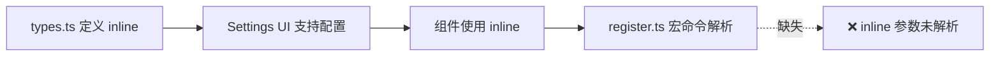

# Milestone 功能问题分析报告

## 目录
1. [问题一：inline 参数不支持](#问题一-inline-参数不支持)
2. [问题二：displayStyle 硬编码](#问题二-displaystyle-硬编码)
3. [问题三：横轴滚动条和 Tooltip 遮挡](#问题三-横轴滚动条和-tooltip-遮挡)
4. [解决方案建议](#解决方案建议)

---

## 问题一：inline 参数不支持

### 问题描述

`inline` 参数在宏命令中填写后不生效，无法控制里程碑组件是否为行内模式。

### 根因分析

**涉及文件**：
- `/workspace/src/lib/milestone/types.ts` (第63行) - `MilestoneConfig` 接口定义了 `inline` 属性
- `/workspace/src/components/SettingsModal/tabs/MilestoneSettings.tsx` (第242-251行, 467-479行) - Settings UI 支持配置 `inline`
- `/workspace/src/components/Milestone/Milestone.tsx` (第65行) - 组件读取 `config.inline` 并应用样式
- `/workspace/src/lib/milestone/register.ts` (第108行) - **宏命令解析函数，未处理 `inline` 参数**

**问题链条**：



**register.ts 第16-18行**：
```typescript
registerRendererArgModel(':milestone', {
  positional: ['displayStyle']  // ❌ 只注册了 displayStyle，没有 inline
});
```

**register.ts 第108行 `parseMacroArguments` 函数**：
```typescript
function parseMacroArguments(type: string, tokens: any): MilestoneConfig {
  const parsed = parseRendererArgs(type, tokens);
  
  // ❌ 没有解析 inline 参数
  // ❌ parsed.inline 永远不会被读取
  
  return {
    // ❌ inline 不会被设置
    displayStyle: displayStyle,
    // ... 其他属性
  };
}
```

**影响**：
- 用户在宏命令中写 `{{renderer :milestone, inline=true}}` 不会生效
- 只能在 Settings 中配置 `inline`，不能在宏命令中动态控制

---

## 问题二：displayStyle 硬编码

### 问题描述

`displayStyle` 新增了两种样式（`arrow-capsule` 和 `timeline-track`），但在宏命令解析处没有同步支持。

### 根因分析

**涉及文件**：
- `/workspace/src/lib/milestone/types.ts` (第71-78行) - 定义了 7 种样式
- `/workspace/src/components/SettingsModal/tabs/MilestoneSettings.tsx` (第14-22行) - UI 支持 7 种样式
- `/workspace/src/components/Milestone/Milestone.tsx` (第40-62行) - 组件支持 7 种样式
- `/workspace/src/lib/milestone/register.ts` (第137行) - **硬编码只支持 5 种样式**

**样式枚举定义（types.ts）**：
```typescript
export type MilestoneDisplayStyle = 
  | 'capsule'        // ✅ 支持
  | 'badge'          // ✅ 支持
  | 'track'          // ✅ 支持
  | 'card'           // ✅ 支持
  | 'compact'        // ✅ 支持
  | 'arrow-capsule'  // ❌ register.ts 未支持
  | 'timeline-track' // ❌ register.ts 未支持
```

**Settings UI（MilestoneSettings.tsx 第14-22行）**：
```typescript
const styleOptions = [
  { value: 'capsule', label: ... },        // ✅
  { value: 'badge', label: ... },          // ✅
  { value: 'track', label: ... },          // ✅
  { value: 'card', label: ... },           // ✅
  { value: 'compact', label: ... },        // ✅
  { value: 'arrow-capsule', label: ... },  // ✅
  { value: 'timeline-track', label: ... }, // ✅
]
```

**宏命令解析（register.ts 第137行）**：
```typescript
// ❌ 硬编码数组，缺少 arrow-capsule 和 timeline-track
if (parsed.displayStyle && ['capsule', 'badge', 'track', 'card', 'compact'].includes(parsed.displayStyle)) {
  displayStyle = parsed.displayStyle as MilestoneDisplayStyle;
}
```

**影响**：
- 用户在 Settings 中可以选择所有 7 种样式
- 用户在宏命令中只能使用前 5 种样式
- 使用 `displayStyle=arrow-capsule` 或 `displayStyle=timeline-track` 会**被忽略**，回退到默认值

**风险**：
如果后续再添加新样式，容易遗漏修改 `register.ts`，造成不一致。

---

## 问题三：横轴滚动条和 Tooltip 遮挡

### 问题描述

在 Logseq 中使用 Milestone 组件时：
1. 横轴滚动条没有出现
2. Tooltip 显示在区域内部，被遮挡

### 根因分析

**涉及文件**：
- `/workspace/src/components/Milestone/milestone.css` (第5-15行) - 容器样式
- `/workspace/src/components/Milestone/styles/CompactMilestone.tsx` - tooltip 位置

**问题一：横轴滚动条不出现**

**容器 CSS（milestone.css 第5-15行）**：
```css
.ltt-milestone-container {
  overflow-x: hidden;  /* ❌ 隐藏水平溢出，阻止滚动条出现 */
  overflow-y: visible;
}
```

**子容器 CSS**：
```css
.ltt-milestone-compact {
  overflow-x: auto;      /* ✅ 设置了自动滚动 */
  min-width: max-content; /* ✅ 设置了最小宽度 */
}
```

**Logseq 环境问题**：
1. Logseq 的 block 容器可能有 `overflow: hidden` 或固定宽度
2. 即使子容器设置了 `overflow-x: auto`，如果**父容器**限制了宽度，子容器无法撑开，也就不会出现滚动条
3. `.ltt-milestone-container` 的 `overflow-x: hidden` 会阻止子元素的滚动条显示

**问题二：Tooltip 遮挡**

**Tooltip CSS（milestone.css 第156-171行）**：
```css
.ltt-milestone-tooltip {
  position: absolute;
  bottom: 100%;          /* 定位在元素上方 */
  left: 50%;
  transform: translateX(-50%);
  /* ... */
  pointer-events: none;   /* 禁用指针事件 */
}
```

**Compact Tooltip CSS（milestone.css 第296-312行）**：
```css
.ltt-milestone-tooltip-compact {
  position: absolute;
  top: 100%;             /* 定位在元素下方 */
  left: 50%;
  transform: translateX(-50%);
  margin-top: var(--ltt-spacing-sm);
  /* ... */
}
```

**遮挡原因**：

1. **父容器 `overflow: hidden`**：`.ltt-milestone-container` 的 `overflow-x: hidden` 可能也会影响垂直方向
2. **z-index 问题**：
   - Tooltip 的 `z-index: 100000`
   - 但 Logseq 的某些元素可能有更高的 z-index
3. **定位上下文问题**：
   - Tooltip 使用 `position: absolute`
   - 需要正确的 `position: relative` 父元素
   - CompactMilestone 组件中，tooltip 的父元素（第95行）设置了 `position: relative`，这是正确的
4. **空间不足**：
   - 当里程碑在页面底部或狭窄空间时，下方的 tooltip 没有足够空间显示
   - 被 Logseq 的页面边界或相邻元素遮挡

**Logseq 特有的问题**：
- Logseq 的页面布局可能有 `overflow: hidden` 或 `position: relative` 的限制
- Block 的容器可能限制了内部元素的绝对定位
- 可能需要使用 Logseq 提供的 Portal 或特定的 API 来渲染 tooltip

---

## 解决方案建议

### 方案一：修复 inline 参数支持

**步骤 1**：修改 `register.ts` 第16-18行
```typescript
registerRendererArgModel(':milestone', {
  positional: ['displayStyle'],
  named: ['inline']  // ✅ 添加 inline 到命名参数
});
```

**步骤 2**：修改 `parseMacroArguments` 函数（第157-169行）
```typescript
return {
  template: parsed.template,
  filterTag: parsed.filterTag || baseConfig.filterTag,
  displayStyle: displayStyle,
  property: parsed.property,
  filterPropKey: parsed.filterPropKey || baseConfig.filterPropKey,
  milestonePropKey: parsed.milestonePropKey || baseConfig.milestonePropKey,
  milestoneList: finalMilestoneList,
  dateField: parsed.dateField || baseConfig.dateField || 'scheduled',
  showProgress: parsed.showProgress !== undefined ? parsed.showProgress !== 'false' : (baseConfig.showProgress !== undefined ? baseConfig.showProgress : settings?.milestone?.showProgress !== false),
  showLabel: parsed.showLabel !== undefined ? parsed.showLabel !== 'false' : (baseConfig.showLabel !== undefined ? baseConfig.showLabel : settings?.milestone?.showLabel !== false),
  inline: parsed.inline !== undefined ? parsed.inline !== 'false' : (baseConfig.inline !== undefined ? baseConfig.inline : settings?.milestone?.inline !== false),  // ✅ 添加 inline 解析
  colorScheme: finalColorScheme,
};
```

---

### 方案二：统一 displayStyle 枚举定义

**步骤 1**：在 `types.ts` 中提取常量
```typescript
// types.ts
export const MILESTONE_DISPLAY_STYLES = [
  'capsule',
  'badge',
  'track',
  'card',
  'compact',
  'arrow-capsule',
  'timeline-track',
] as const;

export type MilestoneDisplayStyle = typeof MILESTONE_DISPLAY_STYLES[number];
```

**步骤 2**：在 `register.ts` 中使用常量
```typescript
// register.ts 第1行
import { MILESTONE_DISPLAY_STYLES, type MilestoneDisplayStyle } from './types';

// register.ts 第137行
if (parsed.displayStyle && MILESTONE_DISPLAY_STYLES.includes(parsed.displayStyle as any)) {
  displayStyle = parsed.displayStyle as MilestoneDisplayStyle;
}
```

**步骤 3**：在 `MilestoneSettings.tsx` 中使用常量
```typescript
// MilestoneSettings.tsx
import { MILESTONE_DISPLAY_STYLES } from '../../../lib/milestone/types';
import { STYLE_LABELS } from '../../../lib/milestone/types';

// 第14-22行
const styleOptions = MILESTONE_DISPLAY_STYLES.map(style => ({
  value: style,
  label: t(`settings.milestone.style${style}`, STYLE_LABELS[style]?.zh || style)
}));
```

---

### 方案三：修复滚动条和 Tooltip 问题

**步骤 1**：修改容器 CSS
```css
/* milestone.css 第5-15行 */
.ltt-milestone-container {
  /* ... 其他样式 */
  overflow-x: visible;  /* ✅ 改为 visible，允许水平滚动 */
  overflow-y: visible;
}

/* 如果需要滚动条，给子容器添加 */
.ltt-milestone-compact,
.ltt-milestone-capsule,
.ltt-milestone-badge .ltt-milestone-grid {
  overflow-x: auto;
  max-width: 100%;  /* ✅ 限制最大宽度 */
}
```

**步骤 2**：优化 Tooltip 定位
```css
/* 为不同样式添加不同的 tooltip 定位策略 */

/* capsule 和 track 样式，tooltip 在上方 */
.ltt-milestone-capsule .ltt-milestone-node:hover .ltt-milestone-tooltip,
.ltt-milestone-track-minimal .ltt-milestone-node:hover .ltt-milestone-tooltip {
  bottom: calc(100% + 8px);  /* 增加间距 */
}

/* compact 和 badge 样式，tooltip 在下方 */
.ltt-milestone-compact:hover .ltt-milestone-tooltip-compact {
  top: calc(100% + 8px);  /* 增加间距 */
}
```

**步骤 3**：检查 Logseq 环境
```typescript
// 在组件中添加环境检测
const isInLogseq = window.location.hostname.includes('logseq');

// 如果在 Logseq 环境中，使用不同的渲染策略
if (isInLogseq) {
  // 使用 Logseq 的 Portal 或特定 API
}
```

---

## 总结

| 问题 | 严重程度 | 影响范围 | 修复复杂度 |
|-----|---------|---------|-----------|
| inline 参数不支持 | 🟡 中等 | 宏命令用户 | 🟢 低 |
| displayStyle 硬编码 | 🟡 中等 | 宏命令用户 | 🟢 低 |
| 滚动条不出现 | 🟡 中等 | 所有用户 | 🟡 中等 |
| Tooltip 遮挡 | 🟢 低 | 部分用户 | 🟡 中等 |

**推荐优先级**：
1. ✅ **高优先级**：修复 `inline` 参数支持（功能缺失）
2. ✅ **高优先级**：统一 `displayStyle` 枚举定义（防止未来遗漏）
3. 🟡 **中优先级**：优化滚动条和 Tooltip（体验优化）

---

**文档生成时间**：2026-05-31
