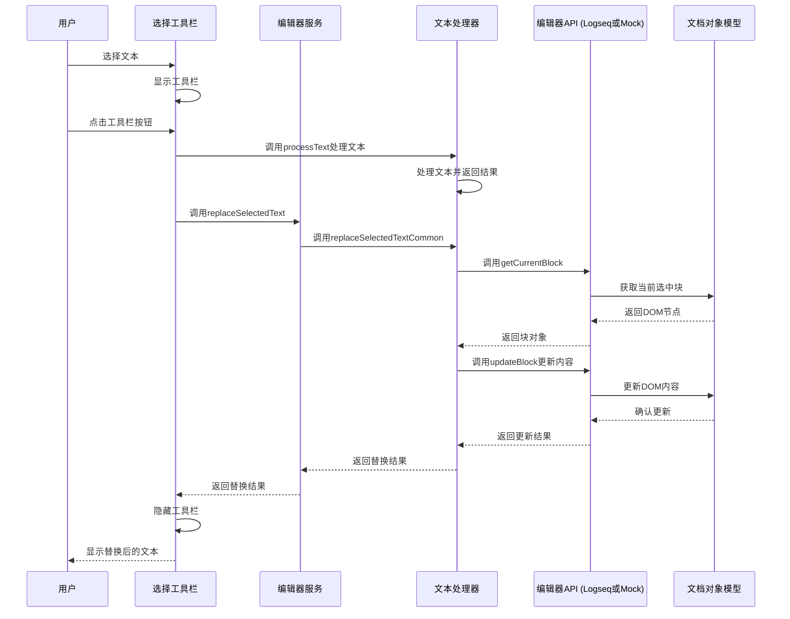

# 文本替换功能时序图

## 执行流程

## 详细流程说明

1. **用户选择文本**：用户在编辑器中选择需要处理的文本
2. **显示工具栏**：SelectToolbar组件检测到文本选择，显示浮动工具栏
3. **用户点击按钮**：用户点击工具栏中的功能按钮（如加粗、斜体等）
4. **处理文本**：SelectToolbar调用processText函数处理选中的文本
5. **替换文本**：处理完成后，调用editorService.replaceSelectedText替换选中的文本
6. **统一替换逻辑**：editorService.replaceSelectedText调用replaceSelectedTextCommon执行统一的替换逻辑
7. **获取当前块**：replaceSelectedTextCommon调用getCurrentBlock获取当前选中的块
8. **更新块内容**：调用updateBlock更新块的内容为处理后的文本
9. **返回结果**：返回替换操作的结果
10. **隐藏工具栏**：替换成功后，隐藏工具栏
11. **显示结果**：用户看到替换后的文本

## 代码执行路径

### 生产环境（Logseq）
1. `SelectToolbar.handleTextProcessed` → 
2. `getEditorService().replaceSelectedText` → 
3. `logseq/editor.js:replaceSelectedText` → 
4. `textProcessor.js:replaceSelectedTextCommon` → 
5. `logseq/editor.js:getCurrentBlock` → 
6. `logseq.Editor.getCurrentBlock` → 
7. `logseq/editor.js:updateBlock` → 
8. `logseq.Editor.updateBlock`

### 测试环境（Mock）
1. `SelectToolbar.handleTextProcessed` → 
2. `getEditorService().replaceSelectedText` → 
3. `test/mock/editor.js:replaceSelectedText` → 
4. `textProcessor.js:replaceSelectedTextCommon` → 
5. `test/mock/editor.js:getCurrentBlock` → 
6. 从localStorage和DOM获取内容 → 
7. `test/mock/editor.js:updateBlock` → 
8. 更新localStorage和DOM内容

## 关键函数说明

### replaceSelectedTextCommon
- **参数**：
  - `getCurrentBlockFn`：获取当前块的函数
  - `updateBlockFn`：更新块内容的函数
  - `processedText`：处理后的文本
- **返回值**：Promise<boolean> - 替换是否成功
- **功能**：执行统一的文本替换逻辑，处理异常情况

### processText
- **参数**：
  - `item`：工具栏项配置
  - `selectedText`：选中的文本
- **返回值**：处理后的文本
- **功能**：根据工具栏项的配置处理选中的文本

### replaceText
- **参数**：
  - `item`：工具栏项配置
  - `text`：原始文本
- **返回值**：替换后的文本
- **功能**：根据正则表达式或模板替换文本
